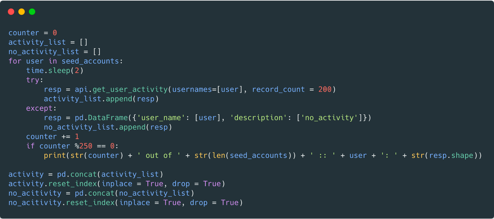

# V2 Twitter API ETL to MySQL

In September 2020, Twitter released a new API [endpoint](https://developer.twitter.com/en/docs/twitter-api/early-access) and modified the payload of the new twitter objects.  The new payload now includes several useful [fields](https://developer.twitter.com/en/docs/twitter-api/metrics) that were not previously available (e.g., like counts and impression data)    

The following repo provides Python wrappers to query the new Twitter API, ETL scripts to store data in a MySQL database, and Jupyter notebooks to interact with the database.

---------

## Data Collection

The analytic workflow starts with collecting data via the new Twitter API by using functions found in the `api_wrapper` module. In order to authenticate with the Twitter API, users must first request a bearer token from the [Twitter developer portal](https://developer.twitter.com/en/portal/projects-and-apps).  

In this example, we queried a set of Twitter accounts that were previously identified to post pro or anti-vaccination content by calling the `get_users` function.  Seed user names are provided in the `seed_accounts.csv` file in the `data` folder. 

Since, the Twitter [API rate limit](https://developer.twitter.com/en/docs/twitter-api/rate-limits#v2-limits) for user look up queries is 900 accounts per 15 minute, the `DataCollection.ipynb` incorporates sleep time to prevent time outs. The workflow also incorporates error handling for empty responses resulting from querying deleted or suspended accounts.    

 

Next, we query the seed accounts for their last 200 posts by calling the `get_user_activity` function.  

{width=600px}

1. `DataCollection.ipynb`: Jupyter notebook to collect data via the Twitter API
2. `docker-compose.yml`: Docker yml file to create a locally hosted MySQL container
3. `DataETL_ToMySQL.ipynb`: Jupyter notebook to create MySQL table structure and translate Twitter data to MySQL
4. `DataAnalysisVisualization.ipynb`: Jupyter notebook to create mention, hashtag, and url networks.

